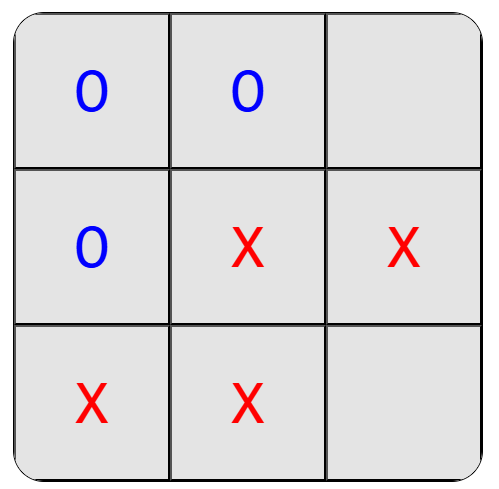

# TIC-TAC-TOE React
## Technical Capability Test Submission

Submission by Tung Nguyen

---

The logic of the game is simple. There are three set of states that the game maintains:

- **Visual states**
    - `gameState`: A 1D array of 9 elements, representing each tile on the board.
    - `winPos`: Represent the final winning tiles' position, will only be used at the end of the game.
- **Logic states** 
    - `gameStatus`: 3-value state representing the game's status (Winner, Tied, On-going.) This determines whether the game should continue with the next player or finalise.
    - `playerPos`: A complex object holding 3 elements:
        - `X` and `O`: 9-bit binary integers representing each player's corresponding positions on the board. An example in action could be `0b100_000_100` - showing that this player currently has the **top-right** and **bottom-right** tiles marked. [^1]
        - `overall` - a utility function representing bitwise `OR` (`|`) operation between `X` and `O` values. If `overall()` returns `0b111_111_111` and no winner is determined, the game ends with `Tie` status.
- **Player states** 
    - `currPlayer`: A string of either value `"X"` or `"O"` -  the current player's symbol.

The game is purely driven by clicking event - meaning that a game will start, continue and finish after a player's click. This logic is carried out by the function `makeMove()`, in four stages upon a player's click.

```tsx
function makeMove(index: number): void {
        // Move of a player starts here
        // 1. Check and skip if current tile is filled
        if (gameState[index] != '') {
            return
        }
        
        // 2. Update game state based on current tile's index,  
        const status: GameStatus = updateAndCheckGameState(index);

        // 3. Update game status
        setGameStatus(status);
        
        // 4. Update next player's symbol (if game continues)
        status != GameStatus.Win ? switchPlayer() : 0;
    }
```

1. Check `gameStatus` to determine if Game should continue.
2. Update Game's state and determine Game's status after changes made. There are three actions done within this step, carried out by `updateAndCheckGameState()`

```tsx
// Generate string array representing gamestate based on players' positions.
        const posAsString = (playPos: PlayerPos) : string[] => {
            // --- Code logic to convert player's position in 9-bit binary 
            // --- to an Array of "X" and "O" characters, usable for gameState 
            // ...
        }

        // Make changes to player's positions on the board
        playerPos[currPlayer] |= (0b000_000_000 | 2 ** index);

        // ...
        // Make changes to & Update "gameState" state
        // Update player's positions on the board
        // ...

        // Return game's status (Win, On-going, Tie) 
        return checkWinner(playerPos, currPlayer)
```

3. Update game status based on the result of previous stage (`Win`, `Tie` or `On`)
4. Determine whether to switch players (continue the game) or stop the game. The reactivity of ReactJS will immediately announce the winner and winning positions in the next render.

*Interesting point: `checkWinner()` function*:
- The `checkWinner()` function works on operating bitwise `OR` (`|`) operations between the current player's (`currPlayer`) `playerPos` & each number in the set of 8 winning combinations.
- The result of this operation will be equal to `playerPos`, if `currPlayer` achieved a winning state.

Here's an example, consider Player X's current positions.
- Case A: Player `X` position: `0b011_010_010`.
```tsx
    let output = 0b011_010_010 | 0b010_010_010
    //           ^playerPos    ^a winning state.
    //                         specifically, the middle-column winning state.
    
    // This will result in output = 0b011_010_010, the same as playerPos
    // Therefore we declare victory for player X 
```


- Case B: Player `X` position: `0b011_110_000`
```tsx
    let output = 0b011_110_000 | 0b010_010_010
    //           ^playerPos      ^the same winning state.
    
    // This will result in output = 0b011_110_010, different from playerPos
    // Therefore we do not declare victory for player X this turn 
```


This mechanic will work in any turn, ensuring simplicity in operations *(instead of performing string or number comparision for columns, rows and diags every move.)*


[^1]: Binary of **0b100_000_100** is mapped from right to left, each group of 3 digits representing top-row middle-row and bottom-row, from left to right on the board. `0 -> 0 -> 1 | 0 -> 0 -> 0 | 0 -> 0 -> 1`
